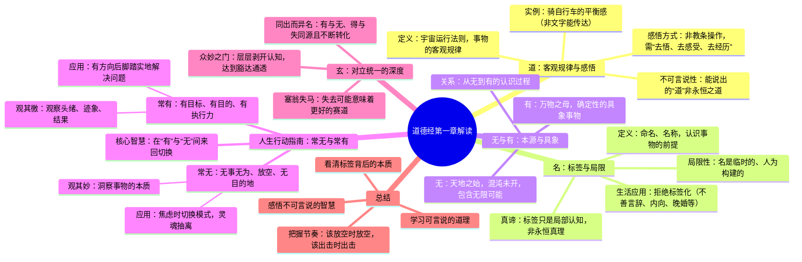

# 道德经第一章解读

## 🧠 本章思维导图

---

## 道，可道，非常道

> 能够用语言表达出来的道，就不是永恒不变的道。

道是什么呢？道是宇宙运行法则，是事物的客观规律。

我们从小就被灌输：
- 要好好读书，要有好的事业 —— 这就是**康庄大道**
- 要勤奋努力，脚踏实地 —— 这就是**成功之道**
- 要有情商，会说话真诚 —— 这就是**爱情之道**

但道是不可言说的，能说出来的道就不是那个恒定不变的道。

### 🌰 生活中的例子

**追爱的攻略**
- 网上能搜出几百条追爱攻略
- 但按照攻略操作未必能收获爱情
- 因为每个人的具体情况都不一样

**学骑自行车**
- 你可以告诉他：双手握龙头、重心放屁股上、双脚轮流蹬地
- 但他大概率学不会
- 因为学骑车需要**平衡感**，需要**克服恐惧**
- 这需要自己去**悟**，去**感受**

道是**动态变化**的，无法完全具象描述，需要自己去经历和感悟。

---

## 名，可名，非常名

> 能够用概念定义出来的名，就不是永恒不变的名。

什么是名？我们可以理解成**命名**、**名称**：
- 你是老板，他是员工 —— 这是名
- 这是苹果，那是梨 —— 这也是名

名是我们认识事物的**前提条件**，也是社会运行的**基础**。

### 🎭 标签的局限性

任何事物我们都可以给它起个名字，但同一种事物因为**地方、时间、条件**的不同，名称又有所不同。名都是**临时的**、**有局限的**，是我们人为构建的。

我们每个人身上都背着很多"名"（标签）：
- 不善言辞
- 没有能力
- 内向
- 胖、美丑

这些标签来自老师、父母、同事，甚至来自你自己。

**老子想告诉我们**：这些标签不是永恒的真理，它们只是某个时刻、某些人对你的**局部认知**。

---

## 无名天地之始，有名万物之母

### 🔮 从无到有

| 状态 | 含义 | 特点 |
|------|------|------|
| **无** | 混沌未开的本源状态 | 无相、包含一切可能性 |
| **有** | 从混沌中分化出来的具体事物 | 确定、可感知 |

我们认识世界就是从**无**到**有**的过程：
- 无 → 一张白纸，充满无数可能
- 有 → 纸上的世界名画，或一篇视频文案

---

## 故常无欲以观其妙，常有欲以观其徼

> 这是第一章的精髓，也是老子给我们的行动指南。

### ⚖️ 有无之间的切换

**无欲**：无事无为，放空，没有目的地状态
- **妙**：事物的本源、本质
- 回到无的状态去**洞察事物的本质**

**有欲**：有目标、有目的、有执行力的状态  
- **徼**：头绪、迹象、结果
- 回到有的状态去**关注细节，解决问题**

### 💡 人生智慧

老子想让我们在**有和无之间来回切换**：

| 状态 | 适用场景 | 做法 |
|------|----------|------|
| **无** | 焦虑、痛苦时 | 抽离灵魂，彻底放下，允许低谷 |
| **有** | 充满灵感和方向时 | 脚踏实地，关注细节，执行到位 |

> **很多人的痛苦来源**：一直让自己处于"常有"的状态，大脑像塞满进程的CPU，从未意识到需要"无"的状态。

---

## 此两者同出而异名，同谓之玄，玄之又玄，众妙之门

### 🌀 对立与统一

"此两者"指的就是**无**和**有**：
- 看起来是对立的
- 其实是**同一个来源**，只是名称不同

**有与无、得与失都是同源的，是在不断转化的。**

🌰 **塞翁失马，焉知非福？**
- 今天失去的工作，可能逼迫你走向更适合的赛道
- 今天吃到的苦头，成为明天避坑的经验

### 🔑 玄之又玄

我们把这种对立统一的关系叫**玄**，深奥而精妙。

人的认知就像剥洋葱：
- 每剥开一层，发现里面还有一层
- 当你理解并深入感悟这个"玄"
- 就能推开**众妙之门**

---

## ✨ 总结

面对人生，我们需要：

1. **学习可言说的道理** + **感悟不可言说的智慧**
2. **看到事物的标签** + **看到背后的本质与内涵**
3. **懂得何时该放空** + **懂得何时该全力出击**

这样才能把握人生的真正节奏，获得真正的豁达与通透。

---

> 📖 道德经第一章笔记 —— 感悟有无之道，把握人生节奏